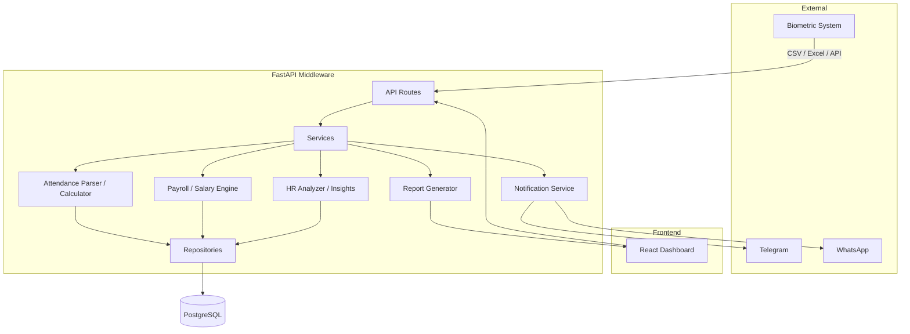

# AI Attendance Agent

AI-powered HR Attendance & Payroll Middleware that sits beside existing biometric attendance systems. It ingests daily exports, applies HR salary rules, generates payroll, produces reports, and sends Telegram/WhatsApp notifications — without replacing your attendance hardware.

## Features

| Area | Capability |
|------|------------|
| **Attendance** | CSV/Excel ingest including the company monthly biometric block export (IN/OUT/WORK/Break/OT/Status per day), work-hour calculation, break tracking, leave/absent handling |
| **Payroll** | Proportional salary deductions, monthly payroll generation, cap at monthly salary |
| **HR Rules** | Min 8h workday, no overtime pay above 8h, absent = full daily deduction |
| **Reports** | Daily summary, monthly payroll, attendance stats — CSV, Excel, PDF with browser download |
| **Notifications** | Daily executive summary after upload; monthly payroll summary after generation |
| **AI Insights** | Deterministic anomaly detection, factual findings, executive summaries (no chatbot) |
| **Dashboard** | React console for attendance, employees, payroll, reports, notifications, settings |

## Architecture



**Layering:** API → Service → Repository → Database. Business logic lives in services and domain modules, not in route handlers.

## Folder Structure

```
AI_Attendance_Agent/
├── backend/
│   └── app/
│       ├── api/           # FastAPI routes
│       ├── attendance/    # Parser, calculator, validator, tracker
│       ├── payroll/       # Salary engine, rule engine, payroll generator
│       ├── ai/            # Deterministic HR analyzer & insights
│       ├── notifications/ # Telegram & WhatsApp providers
│       ├── dashboard/     # Daily summary & analytics
│       ├── services/      # CSV ingest, reports, notifications
│       ├── models/        # SQLAlchemy models
│       ├── database/      # Session, repositories
│       └── main.py
├── frontend/
│   └── src/
│       ├── pages/         # Dashboard, Attendance, Employees, Payroll, etc.
│       ├── components/  # App shell, tables, UI primitives
│       └── services/      # API client
├── sample_data/           # Demo CSV files
├── scripts/
│   └── seed_demo.py       # Load sample data into database
├── tests/
├── uploads/               # Saved attendance uploads
└── reports/               # Generated report files
```

## Setup

### Prerequisites

- Python 3.11+
- Node.js 18+
- PostgreSQL 14+

### 1. Backend

```bash
cd AI_Attendance_Agent
python -m venv venv
source venv/bin/activate
pip install -r requirements.txt

cp .env.example .env
# Edit DATABASE_URL and notification credentials

alembic upgrade head
python scripts/seed_demo.py

uvicorn backend.app.main:app --reload
```

API: http://localhost:8000  
Swagger: http://localhost:8000/docs

### 2. Frontend

```bash
cd frontend
npm install
npm run dev
```

Dashboard: http://localhost:5173 (proxies `/api` to port 8000)

### 3. Tests

```bash
PYTHONPATH=. pytest tests/ -q
```

## Environment Variables

| Variable | Description | Default |
|----------|-------------|---------|
| `DATABASE_URL` | PostgreSQL connection string | — |
| `MIN_WORKING_HOURS` | Minimum payable work hours | `8` |
| `MAX_PAYABLE_HOURS` | Hours cap for salary (no OT pay) | `8` |
| `OVERTIME_PAID` | Pay for hours above max | `false` |
| `BREAK_DURATION_REQUIRED` | Require break column in exports | `true` |
| `DEFAULT_WORKING_DAYS_PER_MONTH` | Working days used for daily/hourly rate | `26` |
| `DEFAULT_MONTHLY_SALARY` | Flat monthly salary applied to all employees in payroll | `30000` |
| `NOTIFICATION_PROVIDER` | `telegram`, `whatsapp`, or `none` | `telegram` |
| `TELEGRAM_TOKEN` / `TELEGRAM_CHAT_ID` | Telegram Bot API | — |
| `WHATSAPP_*` | WhatsApp Cloud API credentials | — |
| `AI_AUTO_NOTIFY` | Auto-send daily/monthly summaries | `true` |
| `REPORTS_DIR` | Report output directory | `reports` |
| `UPLOADS_DIR` | Upload storage directory | `uploads` |
| `EMPLOYEE_DIRECTORY_FILE` | Local salary/master CSV (ID, name, dept, monthly salary) | `sample_data/employees.csv` |
| `AUTO_REGISTER_EMPLOYEES_FROM_ATTENDANCE` | Register IDs/names/depts found in attendance exports (`false` = strict ignore mode) | `true` |
| `OPENAI_API_KEY` | Optional — polish executive summary wording only | — |

See `.env.example` for the full list.

## API Documentation

Base path: `/api/v1`

### Attendance

| Method | Endpoint | Description |
|--------|----------|-------------|
| `POST` | `/attendance/upload` | Upload CSV/Excel biometric export |
| `POST` | `/attendance/ingest-api` | Ingest JSON attendance payload |
| `GET` | `/attendance/daily-summary?work_date=` | Daily attendance summary |
| `GET` | `/attendance/records?work_date=` | Attendance records for a date |
| `GET` | `/attendance/stats?start_date=&end_date=` | Per-employee stats |

### Employees & Rules

| Method | Endpoint | Description |
|--------|----------|-------------|
| `GET` | `/employees` | List employees |
| `POST` | `/employees` | Create or update employee |
| `POST` | `/employees/salary-rules/seed` | Seed default HR rules |

### Payroll

| Method | Endpoint | Description |
|--------|----------|-------------|
| `POST` | `/payroll/generate` | Generate monthly payroll (+ auto-notify) |
| `GET` | `/payroll/{year}/{month}` | List payroll for period |

### Reports

| Method | Endpoint | Description |
|--------|----------|-------------|
| `POST` | `/reports/generate` | Generate CSV/Excel/PDF report |
| `GET` | `/reports/download/{filename}` | Download generated report |

### AI Insights

| Method | Endpoint | Description |
|--------|----------|-------------|
| `GET` | `/ai/insights/daily?work_date=` | Daily insight & findings |
| `GET` | `/ai/insights/monthly?year=&month=` | Monthly insight |
| `GET` | `/ai/executive-summary?work_date=` | Executive summary text |
| `GET` | `/alerts` | Smart alerts (optional date filters) |

### Notifications

| Method | Endpoint | Description |
|--------|----------|-------------|
| `POST` | `/notifications/send` | Send manual message |
| `GET` | `/notifications/logs` | Notification history |

## Screenshots

> Placeholder — add screenshots after running the dashboard:
>
> - `docs/screenshots/dashboard.png`
> - `docs/screenshots/attendance.png`
> - `docs/screenshots/payroll.png`
> - `docs/screenshots/ai-insights.png`

## Sample Workflow

1. **Seed data:** `python scripts/seed_demo.py` loads 5 employees and July attendance.
2. **Upload monthly export:** Attendance page → upload `sample_data/monthly_attendance_july_2026.xlsx` (company biometric block format) or the flat CSVs.
3. **Review:** Dashboard shows present/absent counts; AI Insights shows anomalies.
4. **Payroll:** Payroll page → generate July 2026 payroll.
5. **Reports:** Reports page → generate monthly payroll PDF → auto-download.
6. **Notifications:** Daily summary sent on upload; monthly summary sent on payroll generate (when `AI_AUTO_NOTIFY=true`).

### Supported attendance file layouts

1. **Flat daily table** (CSV / XLS / XLSX) — one row per employee per day.
2. **Company monthly biometric Excel** (XLS / XLSX) — each employee is a block with metadata (`Employee Code`, `Present`, `WO`, `HL`, `LV`, `Absent`, `Total Work+OT`, `Total OT`) and day columns `1–31` with stacked rows `IN`, `OUT`, `WORK`, `Break`, `OT`, `Status`. Parsed by the same `csv_reader.read_attendance_file` into normalized daily records; `WORK` drives payable hours, `OT` is reporting-only.

File type is detected from **file content** (OLE magic for `.xls`, ZIP magic for `.xlsx`), not only the filename extension, so mislabeled biometric exports still import correctly. Upload formats: **CSV, XLS, XLSX**. Report downloads remain **CSV, Excel, PDF** (PDF is not an upload format).

### Employee identity vs salary

- **Attendance export** supplies Employee ID / Empcode, Name, and Department — that is the attendance identity source.
- **Payroll salary** uses the flat `DEFAULT_MONTHLY_SALARY` for every employee in the selected month (configurable via `.env`).
- With `AUTO_REGISTER_EMPLOYEES_FROM_ATTENDANCE=true` (default), employees found in the export are registered automatically.
- Set `AUTO_REGISTER_EMPLOYEES_FROM_ATTENDANCE=false` to ignore unknown IDs (strict safety mode).

## HR Rules (Verified)

- Payroll includes **only** employees with uploaded attendance for the selected month
- All employees share **one** configurable `DEFAULT_MONTHLY_SALARY` for payroll
- Minimum work hours = **8**
- Hours **>= 8** → no deduction; hours **< 8** → `(8 − worked) × hourly rate`
- Hourly rate = `Monthly Salary / Working Days / 8`
- Absent → **full daily** salary deduction (`Monthly / Working Days`)
- Leave / weekly off / holiday = **no** deduction
- Deductions use **only** actual uploaded attendance rows (no manufactured missing days)
- Final salary is clamped: deductions **never exceed** monthly salary; final **never negative**

## Future Improvements

- Scheduled cron jobs for end-of-day reports (helper exists, not wired)
- Runtime HR rule editing via API
- Per-employee attendance history pagination
- Holiday calendar management
- Multi-tenant company support

---

See [docs/AUDIT_REPORT.md](docs/AUDIT_REPORT.md) for the full production audit.
